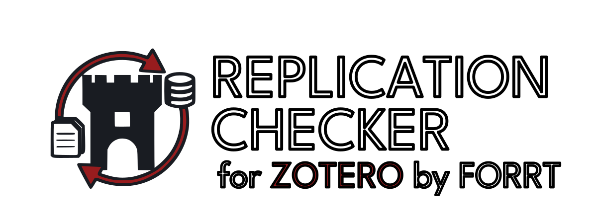

  

  
  

A Zotero plugin that discovers replication studies for items in your library using the [FORRT Library of Reproduction and Replication Attempts (FLoRA)](https://forrt.org/replication-hub/flora/). It scans your local library for DOIs, checks against FLoRA using privacy-preserving prefix matching, notifies you when reproductions and replications exist, and allows easy addition to your library — all without sending identifiable data off your machine.

This plugin was developed as a [FORRT](https://forrt.org/) project to build a working prototype for the open science community. It helps researchers discover replication studies by identifying items with known replications and unobtrusively notifying them via tags and notes.

## Features

- 🔍 **Privacy-preserving matching**: Uses hash prefixes to query the database without exposing your library contents
- 📚 **Batch processing**: Checks entire library, selected items, or collections in one operation
- 🔁 **Replication support**: Detects replication studies, adds outcome-tagged notes, and tags items with "Has Replication" / "Is Replication"
- 🧪 **Reproduction support**: Detects computational reproductions with dedicated notes and "Has Reproduction" / "Is Reproduction" tags
- 📄 **Multiple originals support**: Items with more than one original study receive an "Original Articles" note listing each original's title, DOI, and outcome
- 📖 **Read-only library support**: Automatically detects read-only group libraries and offers to copy originals and replications to your Personal library
- 🏷️ **Automatic tagging**: Adds contextual tags including "Has Replication", "Is Replication", outcome tags, and "Original present in Read-Only Library"
- 📝 **Detailed notes**: Creates child notes with replication/reproduction details (title, authors, journal, outcome, DOI)
- 🗂️ **Configurable folders**: Customize the collection names for replications and reproductions in Preferences
- 🔗 **Smart organization**: Creates separate collections for originals from read-only libraries and their replications
- 🔄 **Bidirectional linking**: Automatically links original studies with their replications as related items
- 🚫 **Blacklist management**: Ban unwanted replications from being re-added during future checks
- ⚡ **Auto-check**: Checks newly added items automatically; scheduled checks (daily/weekly/monthly) also available
- 🌍 **Multi-language support**: Available in 6 languages (English, German, Spanish, French, Portuguese Brazil, Portuguese Europe)

## About the dataset

The Replication Checker uses the [FORRT Literature Database (FLoRA)](https://forrt.org/replication-hub/flora/) that contains replications and reproductions of studies from many different areas of science. These are distinctly divided into:

**Replications** are studies that intentionally repeat prior research to test whether the original findings hold. To be included in FLoRA, a study must:

- Self-identify as a replication (e.g., "replication of Author (Year)") *before* reporting results — replication must be an aim, not just a result
- Identify specific target study/studies that it replicates
- Replicate a study or experiment, not just a single association or finding

Replications can range from close/direct (same methods, same population) to conceptual (testing the same hypothesis with different methods), as long as the above criteria are met. The plugin tags replication outcomes as **Successful**, **Failed**, or **Mixed**, based on how the replication authors characterise their results.

**Reproductions** are attempts to computationally verify whether reported results can be obtained from the original study's data and methods. Reproductions are coded along two dimensions:

- **Computational success**: Were the original results obtained? (*Computationally Successful* vs *Computational Issues*)
- **Robustness**: Do results hold under reasonable alternative specifications? (*Robust*, *Robustness Challenges*, or *Robustness Not Checked*)

**Key distinction**: If new data are collected or used (e.g., an additional decade of data), it is a *replication*. If the same data are re-analysed to verify the original results, it is a *reproduction*.

## Installation

### Prerequisites

Zotero version 7 or later. Guidance on installation and updating for Zotero is available at <https://www.zotero.org/support/installation>

### From XPI File

1. Download the latest `zotero-replication-checker.xpi` from releases
2. Open Zotero version 7+
3. Go to **Tools → Add-ons (or Plugins)**
4. Click the gear icon (⚙️) → **Install Add-on (or Plugins) From File**
5. Select `zotero-replication-checker.xpi`

## Usage

### Check Current Library or Group Libraries

1. Go to **Tools → Check Current Library for Replications**
2. A progress window will show the scan status
3. Items with replications will be tagged and annotated

The command scans whichever library is currently selected in Zotero (personal, group, etc.).

**For editable libraries:**

- Original items get "Has Replication" tag and a replication note
- Replication items are added to "Replication folder" collection
- Items are automatically linked as related items

**For read-only group libraries:**

- Plugin detects the library is read-only
- Shows a confirmation dialog with the count of items with replications
- If you accept:
  - Original items are copied to a new collection named `{LibraryName} [Read-Only]` in your Personal library
  - Replication items are copied to "Replication folder" in your Personal library
  - Both originals and replications get tagged with "Original present in Read-Only Library"
  - All items are linked bidirectionally and replication notes are added

### Check Selected Items or Collections

1. Select one or more items in your library or collections
2. Right-click → **Check for Replications**
3. Selected items will be checked and tagged if replications are found

This works for both editable and read-only libraries, with the same behavior as library-wide checks.

### Check Newly Added Items

- The plugin automatically checks newly added items (enabled by default). You can turn this off from the Replication Checker preferences panel if you prefer to run all scans manually.

### Ban Replications

Sometimes you may want to prevent specific replications from being re-added to your library during future checks.

**To ban a replication:**

1. Right-click on a replication item (tagged with "Is Replication" or "Added by Replication Checker")
2. Select **Ban Replication**
3. Confirm the action
4. The item will be moved to trash and added to your blacklist

**Managing banned replications:**

1. Go to **Zotero → Preferences → Replication Checker for Zotero**
2. Scroll to the "Banned Replications" section
3. View all banned items in a table showing:
   - Replicated Article title
   - Original Article title
   - Date when banned
4. Select an entry and click **Remove Selected** to unban it
5. Click **Clear All Banned Replications** to reset the entire blacklist

**How it works:**

- Banned replications will never be re-added to your library during future checks
- The replication note on the original article still shows ALL replications (including banned ones)
- Only the automatic addition to the "Replication folder" is prevented
- Blacklist is stored locally in Zotero preferences

### Preferences

Open **Zotero → Preferences → Replication Checker for Zotero** to configure:

**Auto-Check Library for Replications:**

- **Frequency options**: Disabled, Daily, Weekly, or Monthly (default: Monthly)
- **Automatically check newly added items**: Enabled by default - items are scanned when added to your library

**Banned Replications:**

- View and manage replications you've banned from appearing in your library
- Remove individual entries or clear all banned replications at once

> **Note:** When you uninstall the plugin, all preferences (including the blacklist) are automatically cleared. This ensures a fresh start if you reinstall.

## How It Works

### Privacy-Preserving Architecture

1. **Hash Generation**: Plugin generates MD5 hash prefixes (first 3 characters) from your DOIs. 
2. **Batch Query**: Sends all prefixes in ONE query to the local database.
3. **Local Verification**: Database returns all candidates matching those prefixes.
4. **Exact Matching**: Plugin verifies locally which candidates actually match your DOIs.

**Privacy guarantee**: The database only sees 3-character hash prefixes, not your actual DOIs. This means that the contents of your library are not shared at any time.

### What Gets Added to Zotero Items

FLoRA contains both Replication and Reproduction attempts.  

When a replication is found:

**For editable libraries:**

- **Tags on original items**:
  - "Has Replication" (easily filter your library)
  - Outcome tags: "Replication: Successful", "Replication: Failure", or "Replication: Mixed"
- **Tags on replication items**:
  - "Is Replication"
- **Note**: Child note on original item with:
  - Replication title
  - Authors and year
  - Journal
  - DOI (clickable link)
  - Outcome (e.g., "successful", "failed", "mixed")
- **Collections**:
  - Replication items added to "Replication folder"
- **Related items**: Bidirectional links between originals and replications

**For read-only libraries:**

- **Tags on copied original items**:
  - "Has Replication"
  - "Original present in Read-Only Library"
  - Outcome tags
- **Tags on replication items**:
  - "Is Replication"
  - "Added by Replication Checker"
  - "Original present in Read-Only Library"
- **Collections**:
  - Original items added to `{LibraryName} [Read-Only]` collection in Personal library
  - Replication items added to "Replication folder" in Personal library
- **Note**: Same replication note structure as editable libraries
- **Related items**: Bidirectional links maintained

When a reproduction is found:

Follows the same logic as described for replication but only "Has Reproduction" tag is added. Outcome is included in the note. 

If both a reproduction and replication are found, separate notes and tags are created for each.

> **Note:** The note is automatically generated by the plugin. If manually edited, a new note will be created on the next check and the edited version will be kept as-is.  

### What Does Replication Outcome Mean?

The plugin automatically creates a tag and an entry in the note based on the FLoRA Database outcome column. This is coded based on how authors interpreted their results. Tags are created only for outcomes "Replication: Successful", "Replication: Failure" and "Replication: Mixed". This is to enable filtering in Zotero based on the replication outcome.

### What Does Reproduction Outcome Mean?

The plugin automatically creates an entry in the note based on the FLoRA Database outcome column. This is coded based on how authors interpreted their results. Tags are created only for 6 outcomes:  
- computionally successful, robust. 
- computionally successful, robustness challenges. 
- computionally successful, robustness not checked. 
- computational issues, robust. 
- computational issues, robustness challenges. 
- computational issues, robustness not checked. 

These describe the results based on whether the analysis code led to the results as reported (computationally succesful) and whether robustness tests achieved the same results.

### What Does it Mean if "The study has a linked report"

Some studies are linked to a separate URL. This happens in two cases:
- The study does not have a published version, therefore it does not have a DOI but a URL
- The study is part of a multi-study replication effort. The DOI links to the published study, while the URL links to a replication report in a public repositories (e.g. OSF, Zenodo)

## Data Source

Currently uses a live API endpoint (<https://rep-api.forrt.org/v1/prefix-lookup>) to query the FORRT Library of Reproduction and Replication Attempts (FLoRA) for up-to-date replication studies. The API returns candidates based on 3-character MD5 hash prefixes, ensuring privacy by not requiring full DOIs.

## Localization

The plugin supports multiple languages and automatically uses your Zotero language preference.

**Currently available languages:**

- English (en-US) ✅
- German (de) ✅
- Spanish (es) ✅
- French (fr) ✅
- Portuguese / Brazil (pt-BR) ✅
- Portuguese / Europe (pt-PT) ✅

**What gets translated:**

- All menu items and dialogs
- Progress messages and alerts
- Tags (e.g., "Has Replication" → "Hat Replikation" in German)
- Note headings and content
- Preference panel labels

**Adding new languages:**

Want to use the plugin in your language? See [LOCALIZATION.md](docs/LOCALIZATION.md) for a complete guide on adding translations. Contributing a translation is easy - just copy the English `.ftl` file and translate the strings while preserving placeholders.

## Citation

If you use this plugin in your research, please cite it as:

> Wallrich, L., Tondlekar, R., Weinerova, J., Röseler, L., Baldoni, C., Fouilloux, A., Meier, M., Flores Kanter, P. E., Trajano, I., Vaidis, D. C., Müller, M., Arriaga, P., & Coulson, H. D. (2026). *Zotero Replication Checker* [Software]. <https://doi.org/10.5281/zenodo.18671300>

A `citation.cff` file is also included in the repository for automated citation tools (e.g. GitHub's "Cite this repository" button).

## Feedback

Do you have feedback for us? Open an issue [here](https://github.com/forrtproject/flora-zotero/issues) if you encounter bugs or documentation issues. You can also [contact us anonymously about the Replication Checker](https://tinyurl.com/y5evebv9).
